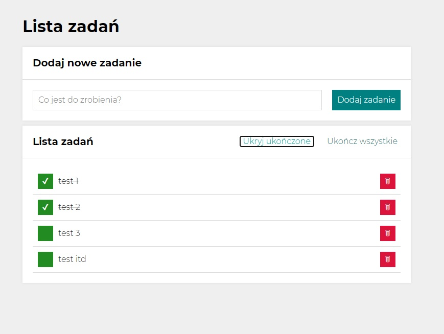

# To-do list

## DEMO

[**To-do-list**](https://piotrkubiak.github.io/todo-list-react/)

### What is it and how to use it

It is an application for creating a to-do list

1. Enter the various tasks to be performed in the box
2. When you complete the task, you can click the green icon and mark it as completed
3. You can also delete a given task by clicking on the red icon
4. You can hide selected tasks by clicking "Ukryj ukończone"
5. You can select them all at once by clicking: "Ukończ wszystkie"

Thanks to the use of Local Storage, the tasks did not get deleted after restarting or refreshing the browser.
You can approve tasks by clicking Enter.
The application works correctly on high resolutions and on small ones.

**Thank you for using the app!**

### Technologies used to create the application:

- HTML
- CSS (FLEX, GRID, Media queries)
- JavaScript (React - Redux)
- Styled Components
- Custom hooks

# Getting Started with Create React App

This project was bootstrapped with [Create React App](https://github.com/facebook/create-react-app).

## Available Scripts

In the project directory, you can run:

### `npm start`

Runs the app in the development mode.\
Open [http://localhost:3000](http://localhost:3000) to view it in the browser.

The page will reload if you make edits.\
You will also see any lint errors in the console.

### `npm run build`

Builds the app for production to the `build` folder.\
It correctly bundles React in production mode and optimizes the build for the best performance.

The build is minified and the filenames include the hashes.\
Your app is ready to be deployed!

See the section about [deployment](https://facebook.github.io/create-react-app/docs/deployment) for more information.

### `npm run eject`

**Note: this is a one-way operation. Once you `eject`, you can’t go back!**

If you aren’t satisfied with the build tool and configuration choices, you can `eject` at any time. This command will remove the single build dependency from your project.

Instead, it will copy all the configuration files and the transitive dependencies (webpack, Babel, ESLint, etc) right into your project so you have full control over them. All of the commands except `eject` will still work, but they will point to the copied scripts so you can tweak them. At this point you’re on your own.

You don’t have to ever use `eject`. The curated feature set is suitable for small and middle deployments, and you shouldn’t feel obligated to use this feature. However we understand that this tool wouldn’t be useful if you couldn’t customize it when you are ready for it.
